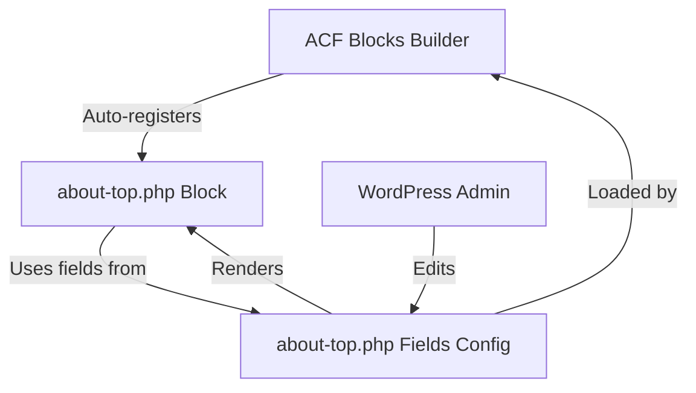

# About Top Block - Dynamic Migration Plan

## Overview
Convert the [`about-top.php`](../acf-blocks/about-top.php:1) ACF block from hardcoded content to dynamic ACF fields, following the pattern established in [`integrated-consulting-service.php`](../acf-blocks/integrated-consulting-service.php:1).

## Current State Analysis

### Hardcoded Content in about-top.php
```
Line 22: <h1>Adding brilliance to your project...</h1>
Line 24-29: <p>Lighting has been our world since 1995...</p>
Line 36: 
```

### Identified Fields Needed

| Field Name | Type | Required | Purpose |
|------------|------|----------|---------|
| `main_heading` | textarea | Yes | Main h1 heading on left side |
| `description` | wysiwyg | No | Content paragraph below heading |
| `right_image` | image | Yes | Featured image on right side |

## Architecture Pattern

Following the established pattern from [`integrated-consulting-service.php`](../acf-blocks/integrated-consulting-service.php:1):



## Implementation Steps

### Step 1: Create ACF Field Configuration
**File**: [`acf-blocks/fields/about-top.php`](../acf-blocks/fields/about-top.php:1)

Fields to include:
- **Main Heading** (textarea)
  - Key: `field_abt_main_heading`
  - Name: `main_heading`
  - Required: Yes
  - Rows: 3
  - Default: Current hardcoded heading

- **Description** (wysiwyg)
  - Key: `field_abt_description`
  - Name: `description`
  - Required: No
  - Toolbar: basic
  - Default: Current hardcoded description

- **Right Image** (image)
  - Key: `field_abt_right_image`
  - Name: `right_image`
  - Required: Yes
  - Return format: array
  - Preview size: medium

### Step 2: Update Block Template
**File**: [`acf-blocks/about-top.php`](../acf-blocks/about-top.php:1)

Changes needed:
1. Add ACF field getters at the top
2. Add block preview placeholder
3. Replace hardcoded h1 with `<?php echo wp_kses_post( nl2br( $main_heading ) ); ?>`
4. Replace hardcoded paragraph with `<?php echo wp_kses_post( wpautop( $description ) ); ?>`
5. Replace hardcoded image with dynamic image array
6. Add conditional rendering for each section
7. Use `$block_id` and `$block_class` variables (available from builder)

### Step 3: Security & Best Practices
- Use `wp_kses_post()` for HTML content
- Use `esc_html()` for plain text
- Use `esc_url()` for URLs
- Use `esc_attr()` for attributes
- Add `nl2br()` for textarea line breaks
- Add `wpautop()` for WYSIWYG content formatting
- Implement proper conditional checks before rendering

## File Structure

```
acf-blocks/
├── about-top.php              (Block template - TO UPDATE)
└── fields/
    ├── about-top.php          (Field config - TO CREATE)
    ├── example-block.php
    └── integrated-consulting-service.php

inc/
└── acf-blocks-builder.php     (Auto-loads fields - NO CHANGES)
```

## Code References

### Pattern to Follow
- Field registration: [`fields/integrated-consulting-service.php`](../acf-blocks/fields/integrated-consulting-service.php:1)
- Template structure: [`integrated-consulting-service.php`](../acf-blocks/integrated-consulting-service.php:1)
- Auto-loader: [`inc/acf-blocks-builder.php`](../inc/acf-blocks-builder.php:107)

### Key WordPress/ACF Functions
- `get_field()` - Retrieve ACF field value
- `acf_add_local_field_group()` - Register field group
- `wp_kses_post()` - Sanitize HTML content
- `wpautop()` - Convert line breaks to paragraphs
- `nl2br()` - Convert newlines to `<br>` tags

## Expected Behavior After Implementation

1. **WordPress Admin**:
   - Block appears in "Puk" category
   - Shows preview placeholder when empty
   - Displays configured content when fields are filled

2. **Frontend**:
   - Renders dynamic content from ACF fields
   - Maintains existing CSS classes and structure
   - Gracefully handles empty/missing fields

3. **Compatibility**:
   - Works with existing [`inc/acf-blocks-builder.php`](../inc/acf-blocks-builder.php:1) auto-registration
   - No modifications needed to existing files
   - Follows WordPress and ACF best practices

## Migration Benefits

- ✅ Content managed through WordPress admin
- ✅ No code changes needed for content updates
- ✅ Consistent with other dynamic blocks
- ✅ Supports multilingual content
- ✅ Better content governance
- ✅ Reusable across multiple pages

## Notes

- The block uses `container-fluid` class (Bootstrap)
- CSS classes remain unchanged to preserve styling
- Image alt text fallback: "About Image"
- Block already registered by [`acf-blocks-builder.php`](../inc/acf-blocks-builder.php:1)
