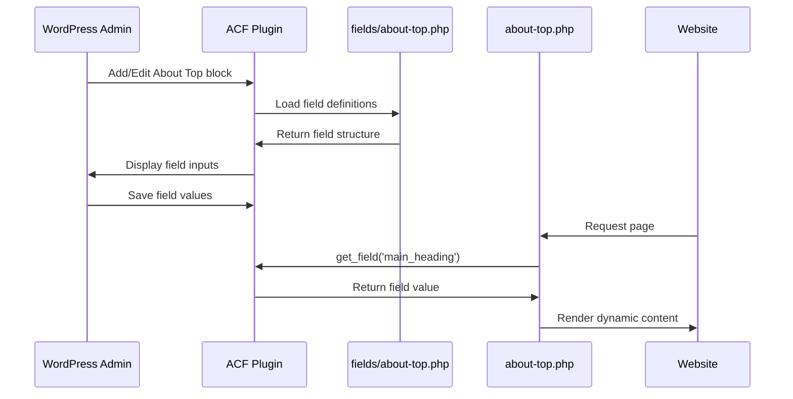

# About Top Block - Code Examples

## File 1: ACF Field Configuration
**Path**: `acf-blocks/fields/about-top.php` (NEW FILE)

```php
<?php
/**
 * ACF Field Group: About Top
 * 
 * @package Puk
 */

if ( ! function_exists( 'acf_add_local_field_group' ) ) {
    return;
}

acf_add_local_field_group( array(
    'key' => 'group_about_top',
    'title' => __( 'About Top Block', 'puk' ),
    'fields' => array(
        array(
            'key' => 'field_abt_main_heading',
            'label' => __( 'Main Heading', 'puk' ),
            'name' => 'main_heading',
            'type' => 'textarea',
            'instructions' => __( 'Enter the main heading (supports line breaks)', 'puk' ),
            'required' => 1,
            'rows' => 3,
            'default_value' => 'Adding brilliance to your project by combining creativity, precision, and a passion for excellence.',
            'placeholder' => __( 'Enter main heading...', 'puk' ),
        ),
        array(
            'key' => 'field_abt_description',
            'label' => __( 'Description', 'puk' ),
            'name' => 'description',
            'type' => 'wysiwyg',
            'instructions' => __( 'Content below the heading (supports multiple paragraphs)', 'puk' ),
            'required' => 0,
            'tabs' => 'all',
            'toolbar' => 'basic',
            'media_upload' => 0,
            'delay' => 0,
            'default_value' => 'Lighting has been our world since 1995.
We specialise in the study and creation
of lighting solutions for architectural
and outdoor applications.',
        ),
        array(
            'key' => 'field_abt_right_image',
            'label' => __( 'Right Side Image', 'puk' ),
            'name' => 'right_image',
            'type' => 'image',
            'instructions' => __( 'Upload the featured image for right side', 'puk' ),
            'required' => 1,
            'return_format' => 'array',
            'preview_size' => 'medium',
            'library' => 'all',
        ),
    ),
    'location' => array(
        array(
            array(
                'param' => 'block',
                'operator' => '==',
                'value' => 'acf/about-top',
            ),
        ),
    ),
    'menu_order' => 0,
    'position' => 'normal',
    'style' => 'default',
    'label_placement' => 'top',
    'instruction_placement' => 'label',
    'hide_on_screen' => '',
    'active' => true,
    'description' => __( 'Fields for About Top block', 'puk' ),
) );
```

---

## File 2: Updated Block Template
**Path**: `acf-blocks/about-top.php` (UPDATE EXISTING)

```php
<?php
/**
 * Block Template: About Top
 * 
 * @package Puk
 */

// Exit if accessed directly
if ( ! defined( 'ABSPATH' ) ) {
    exit;
}

// Get ACF fields
$main_heading = get_field( 'main_heading' );
$description = get_field( 'description' );
$right_image = get_field( 'right_image' );

// Block preview placeholder in admin
if ( $is_preview && empty( $main_heading ) ) {
    echo '<div style="padding: 20px; background: #f0f0f0; border: 2px dashed #ccc; text-align: center;">';
    echo '<p>' . __( 'About Top Block - Configure fields in the sidebar', 'puk' ) . '</p>';
    echo '</div>';
    return;
}
?>

<!-- About Us section one start  -->
<section id="<?php echo esc_attr( $block_id ); ?>" class="<?php echo esc_attr( $block_class ); ?> abt_us_1"> 
    <div class="container-fluid">
        <div class="row">

            <div class="col-xl-5 col-lg-5 col-md-5 col-sm-12 abt_us_1_lft_row">
                <div class="abt_us_1_lft">
                    <?php if ( $main_heading ) : ?>
                        <h1><?php echo wp_kses_post( nl2br( $main_heading ) ); ?></h1>
                    <?php endif; ?>

                    <?php if ( $description ) : ?>
                        <?php echo wp_kses_post( wpautop( $description ) ); ?>
                    <?php endif; ?>
                </div>
            </div> 

            <div class="col-xl-7 col-lg-7 col-md-7 col-sm-12">
                <div class="abt_us_1_right">
                    <?php if ( $right_image ) : ?>
                        <!-- image  -->
                        <div class="abt_us_1_right_img">
                            " 
                                alt="<?php echo esc_attr( $right_image['alt'] ?: __( 'About Image', 'puk' ) ); ?>"
                                width="<?php echo esc_attr( $right_image['width'] ); ?>"
                                height="<?php echo esc_attr( $right_image['height'] ); ?>"
                            >
                        </div>
                    <?php endif; ?>
                </div>
            </div>

        </div>
    </div>
</section> 
<!-- About Us section one end  -->
```

---

## Key Changes Explained

### 1. ACF Field Retrieval (Lines 13-15)
```php
$main_heading = get_field( 'main_heading' );
$description = get_field( 'description' );
$right_image = get_field( 'right_image' );
```
**Purpose**: Fetch dynamic content from ACF fields instead of hardcoding

### 2. Admin Preview Placeholder (Lines 17-23)
```php
if ( $is_preview && empty( $main_heading ) ) {
    echo '<div style="padding: 20px; background: #f0f0f0; border: 2px dashed #ccc; text-align: center;">';
    echo '<p>' . __( 'About Top Block - Configure fields in the sidebar', 'puk' ) . '</p>';
    echo '</div>';
    return;
}
```
**Purpose**: Show helpful placeholder in WordPress editor when block is empty

### 3. Dynamic Block Attributes (Line 27)
```php
<section id="<?php echo esc_attr( $block_id ); ?>" class="<?php echo esc_attr( $block_class ); ?> abt_us_1">
```
**Purpose**: Add unique ID and classes provided by ACF block system

### 4. Conditional Rendering (Lines 34-36)
```php
<?php if ( $main_heading ) : ?>
    <h1><?php echo wp_kses_post( nl2br( $main_heading ) ); ?></h1>
<?php endif; ?>
```
**Purpose**: Only render heading if field has content

### 5. Security Functions Used

| Function | Usage | Purpose |
|----------|-------|---------|
| `esc_attr()` | HTML attributes | Prevent XSS in attributes |
| `esc_url()` | Image URL | Validate and sanitize URLs |
| `wp_kses_post()` | HTML content | Allow safe HTML tags |
| `nl2br()` | Textarea | Convert line breaks to `<br>` |
| `wpautop()` | WYSIWYG | Convert to paragraphs |

### 6. Image Array Handling (Lines 48-55)
```php
<?php if ( $right_image ) : ?>
    " 
        alt="<?php echo esc_attr( $right_image['alt'] ?: __( 'About Image', 'puk' ) ); ?>"
        width="<?php echo esc_attr( $right_image['width'] ); ?>"
        height="<?php echo esc_attr( $right_image['height'] ); ?>"
    >
<?php endif; ?>
```
**Purpose**: Access image array properties with fallback for alt text

---

## Comparison: Before vs After

### BEFORE (Hardcoded)
```php
<h1>Adding brilliance to your project...</h1>
<p>Lighting has been our world since 1995...</p>

```

### AFTER (Dynamic)
```php
<?php if ( $main_heading ) : ?>
    <h1><?php echo wp_kses_post( nl2br( $main_heading ) ); ?></h1>
<?php endif; ?>

<?php if ( $description ) : ?>
    <?php echo wp_kses_post( wpautop( $description ) ); ?>
<?php endif; ?>

<?php if ( $right_image ) : ?>
    " 
        alt="<?php echo esc_attr( $right_image['alt'] ?: __( 'About Image', 'puk' ) ); ?>"
    >
<?php endif; ?>
```

---

## How It Works



---

## Testing Checklist

After implementation, verify:
- ✅ Block appears in "Puk" block category
- ✅ Preview placeholder shows when empty
- ✅ All 3 fields editable in sidebar
- ✅ Content saves and displays correctly
- ✅ Line breaks in heading work properly
- ✅ Image displays with proper attributes
- ✅ Empty fields don't break layout
- ✅ HTML tags in description render safely
- ✅ Block ID and classes applied correctly

---

## WordPress Admin Experience

**When adding the block:**
1. Click "+" to add block
2. Search for "About Top" in "Puk" category
3. See preview placeholder
4. Configure fields in right sidebar:
   - Main Heading (textarea)
   - Description (WYSIWYG editor)
   - Right Side Image (media uploader)
5. Content updates instantly in preview
6. Publish/Update page

**Field validation:**
- Main Heading: Required (red border if empty)
- Right Image: Required (must upload image)
- Description: Optional (can be left empty)
