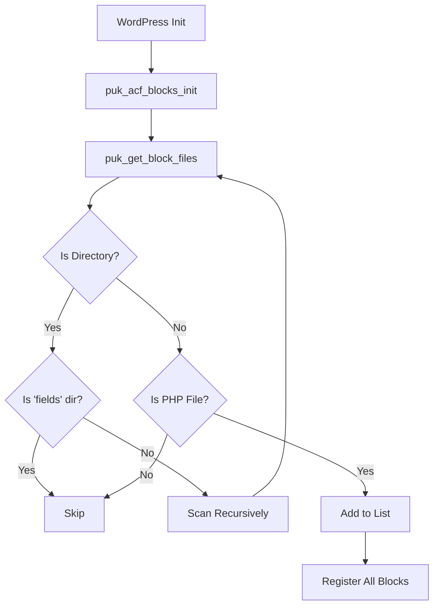

# ACF Blocks Builder - Subdirectory Support Fix

## Problem
When moving [`about-top.php`](../acf-blocks/about-us/about-top.php:1) from `acf-blocks/` to `acf-blocks/about-us/`, the block was no longer available in WordPress admin.

### Root Cause
The original [`inc/acf-blocks-builder.php`](../inc/acf-blocks-builder.php:40) used:
```php
$block_files = glob( $block_dir . '*.php' );
```

This only scans for PHP files **directly** in `acf-blocks/`, not in subdirectories.

---

## Solution Implemented

### 1. Added Recursive File Scanner Function
**Location**: [`inc/acf-blocks-builder.php`](../inc/acf-blocks-builder.php:32) (Lines 32-73)

```php
function puk_get_block_files( $dir, $exclude = array( 'fields' ) ) {
    $files = array();
    
    if ( ! is_dir( $dir ) ) {
        return $files;
    }
    
    $items = scandir( $dir );
    
    foreach ( $items as $item ) {
        if ( $item === '.' || $item === '..' ) {
            continue;
        }
        
        $path = $dir . '/' . $item;
        
        // Skip excluded directories
        if ( is_dir( $path ) && in_array( $item, $exclude ) ) {
            continue;
        }
        
        // Recursively scan subdirectories
        if ( is_dir( $path ) ) {
            $files = array_merge( $files, puk_get_block_files( $path, $exclude ) );
        } 
        // Add PHP files
        elseif ( pathinfo( $path, PATHINFO_EXTENSION ) === 'php' ) {
            $files[] = $path;
        }
    }
    
    return $files;
}
```

**Features**:
- ✅ Recursively scans all subdirectories
- ✅ Excludes `fields/` directory (contains field configs, not blocks)
- ✅ Finds PHP files at any depth level
- ✅ Returns complete file paths for registration

### 2. Updated Block Registration
**Location**: [`inc/acf-blocks-builder.php`](../inc/acf-blocks-builder.php:75) (Line 89)

**Changed from**:
```php
$block_files = glob( $block_dir . '*.php' );
```

**Changed to**:
```php
$block_files = puk_get_block_files( $block_dir );
```

---

## Supported Directory Structures

The builder now supports any organizational structure:

### ✅ Flat Structure (Original)
```
acf-blocks/
├── example-block.php               ✅ Registered
├── integrated-consulting-service.php ✅ Registered
└── fields/
    ├── example-block.php           ⚪ Excluded (not a block)
    └── integrated-consulting-service.php ⚪ Excluded
```

### ✅ Categorized Structure (NEW Support)
```
acf-blocks/
├── about-us/
│   └── about-top.php               ✅ Registered (NEW!)
├── services/
│   ├── service-card.php            ✅ Registered
│   └── service-grid.php            ✅ Registered
├── hero/
│   ├── hero-slider.php             ✅ Registered
│   └── hero-banner.php             ✅ Registered
└── fields/
    ├── about-top.php               ⚪ Excluded
    ├── service-card.php            ⚪ Excluded
    └── service-grid.php            ⚪ Excluded
```

### ✅ Mixed Structure
```
acf-blocks/
├── example-block.php               ✅ Registered (root level)
├── about-us/
│   ├── about-top.php               ✅ Registered (1 level deep)
│   └── team/
│       └── team-member.php         ✅ Registered (2 levels deep)
└── fields/                         ⚪ Always excluded
```

---

## How It Works



---

## Testing Steps

### 1. Clear WordPress Cache
```bash
# If using WP-CLI
wp cache flush

# Or via WordPress admin
# Go to: Settings → (Your caching plugin) → Clear cache
```

### 2. Verify Block Registration
1. Go to WordPress admin
2. Edit any page
3. Click "Add block" (+)
4. Search for "About Top"
5. Should appear in "Puk" category

### 3. Check All Blocks Load
Expected blocks (after your current structure):
- ✅ Example Block (from root)
- ✅ Integrated Consulting Service (from root)
- ✅ About Top (from `about-us/` subdirectory)

### 4. Test Block Functionality
1. Add "About Top" block to page
2. Configure fields in sidebar
3. Preview should show content
4. Publish and verify on frontend

---

## Benefits of This Update

| Feature | Before | After |
|---------|--------|-------|
| **Organization** | All blocks in one folder | Can organize by category |
| **Scalability** | Gets messy with many blocks | Clean, organized structure |
| **Maintenance** | Hard to find specific blocks | Easy to locate by category |
| **Team Workflow** | All devs edit same directory | Can work on separate folders |
| **Subdirectory Support** | ❌ Not supported | ✅ Fully supported |
| **Deep Nesting** | ❌ Not supported | ✅ Unlimited depth |

---

## Migration Guide

### Moving Existing Blocks to Subdirectories

**Before moving**:
```
acf-blocks/
├── my-block.php
└── fields/
    └── my-block.php
```

**After moving**:
```
acf-blocks/
├── category-name/
│   └── my-block.php
└── fields/
    └── my-block.php  ← Keep in fields/ (not in subdirectory)
```

**Steps**:
1. Create category directory: `acf-blocks/category-name/`
2. Move block file: `my-block.php` → `category-name/my-block.php`
3. Keep field config in `fields/my-block.php` (don't move)
4. Clear WordPress cache
5. Verify block appears in admin

**Important**: Field configuration files should always stay in `acf-blocks/fields/`, regardless of where the block template is located.

---

## Technical Details

### Function Signature
```php
function puk_get_block_files( $dir, $exclude = array( 'fields' ) )
```

**Parameters**:
- `$dir` (string) - Root directory to scan
- `$exclude` (array) - Directory names to exclude (default: `['fields']`)

**Returns**:
- `array` - List of absolute file paths to PHP block files

### Exclusion Logic
The function excludes:
- `.` and `..` (current/parent directory references)
- Any directory matching names in `$exclude` array
- Non-PHP files (only `.php` extension included)

### Performance Considerations
- Uses native PHP `scandir()` for speed
- Early return if directory doesn't exist
- Minimal memory footprint with array merging
- Efficient recursive scanning

---

## Backward Compatibility

✅ **100% Backward Compatible**

- Blocks in root `acf-blocks/` directory still work
- No changes needed to existing block files
- Field loading unchanged
- Block registration API unchanged
- Existing sites won't break

---

## Current File Structure

After the fix, your structure is:

```
acf-blocks/
├── example-block.php                      ✅ Root level block
├── integrated-consulting-service.php      ✅ Root level block
├── about-us/
│   └── about-top.php                      ✅ Subdirectory block (NOW WORKS!)
└── fields/
    ├── about-top.php                      ⚪ Field config (excluded from scanning)
    ├── example-block.php                  ⚪ Field config
    └── integrated-consulting-service.php  ⚪ Field config
```

---

## Troubleshooting

### Block Still Not Appearing

**1. Clear all caches**:
```bash
# PHP opcache
opcache_reset()

# WordPress cache
wp cache flush

# Browser cache
Hard refresh (Ctrl+Shift+R or Cmd+Shift+R)
```

**2. Check file permissions**:
```bash
# Files should be readable
chmod 644 acf-blocks/about-us/about-top.php
```

**3. Verify ACF Pro is active**:
- Go to: Plugins → Installed Plugins
- Ensure "Advanced Custom Fields PRO" is active

**4. Check for PHP errors**:
- Enable WordPress debug mode in `wp-config.php`:
```php
define( 'WP_DEBUG', true );
define( 'WP_DEBUG_LOG', true );
```
- Check `wp-content/debug.log` for errors

**5. Verify file path**:
```php
// Add this temporarily to functions.php to debug
add_action( 'init', function() {
    $files = puk_get_block_files( get_template_directory() . '/acf-blocks' );
    error_log( 'Found blocks: ' . print_r( $files, true ) );
});
```

### Field Group Not Loading

**Issue**: Block appears but has no fields in sidebar

**Solution**: Field config must be in `acf-blocks/fields/about-top.php`, not in the subdirectory.

**Correct structure**:
```
acf-blocks/
├── about-us/
│   └── about-top.php          ← Block template
└── fields/
    └── about-top.php          ← Field configuration (HERE!)
```

---

## Summary

The [`inc/acf-blocks-builder.php`](../inc/acf-blocks-builder.php:1) has been updated to support organizing blocks in subdirectories while maintaining full backward compatibility. The `about-top` block in [`acf-blocks/about-us/about-top.php`](../acf-blocks/about-us/about-top.php:1) will now be automatically detected and registered.
